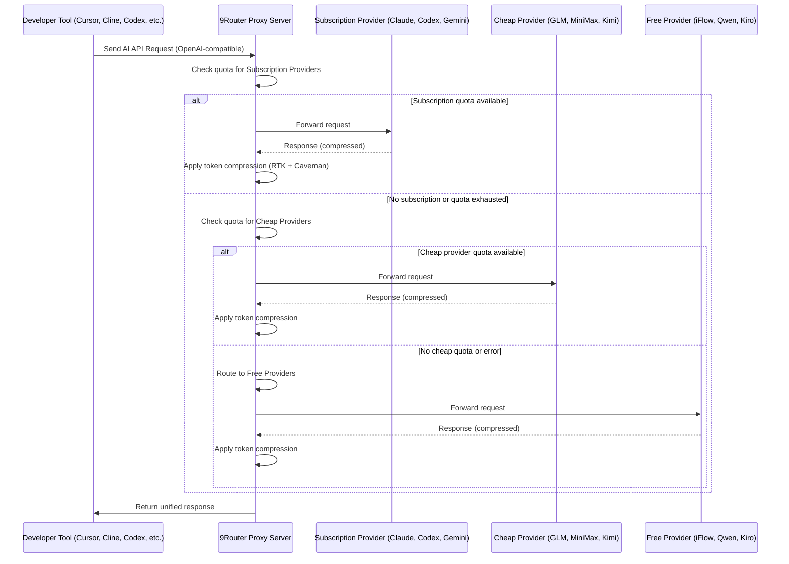

# System Execution Sequence Diagram: 9router

This diagram traces the main system flow: developer tools send requests to 9router, which routes the call based on quota/cost, applies token optimization, and relays the result back in the original tool’s expected format.