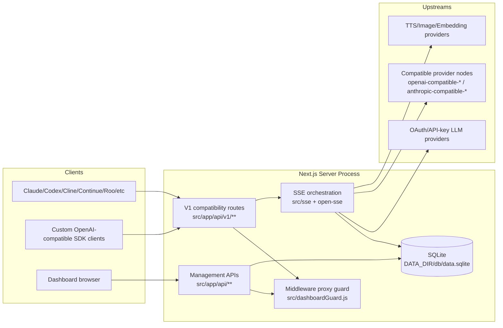
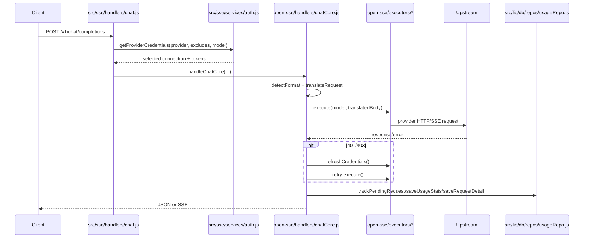

# 9Router Architecture

_Last updated: 2026-05-19_

## 1. Purpose and System Boundaries

9Router is a local AI gateway and operator dashboard implemented as a Next.js application with an OpenAI-compatible edge (`/v1/*`) and a management API (`/api/*`).

At runtime, a single server process hosts:

- compatibility endpoints (`src/app/api/v1/**`, `src/app/api/v1beta/**`),
- dashboard APIs (`src/app/api/**`),
- routing/translation/executor core (`src/sse/**`, `open-sse/**`),
- persistence (SQLite under `DATA_DIR/db/data.sqlite`),
- tunnel/MITM bootstrap and lifecycle management (`src/shared/services/initializeApp.js`, `src/mitm/**`, `src/lib/tunnel/**`).

Out of scope for this repository:

- upstream model provider control planes,
- hosted cloud control backends that external clients may call,
- external CLI binaries (Claude Code, Codex CLI, Cursor, etc.).

## 2. Runtime Topology and Request Surfaces

### Key routing rule

`next.config.mjs` rewrites `/v1/*` to `/api/v1/*` and keeps `/codex/*` mapped to `/api/v1/responses` (`next.config.mjs:40-63`).

## 3. Startup and Process Lifecycle

Startup entrypoints:

- `src/server-init.js` calls `initializeApp()`.
- `src/lib/initCloudSync.js` triggers `ensureAppInitialized()` at runtime (except build phase).

`initializeApp()` in `src/shared/services/initializeApp.js` performs early lifecycle tasks:

- cleanup of stale provider connection fields (`cleanupProviderConnections`),
- tunnel/tailscale auto-resume when settings indicate enabled state,
- process signal handlers for cleanup (`SIGINT`, `SIGTERM`, `exit`),
- MITM bootstrap and DNS restore, and
- watchdog/network monitor loops for self-healing restarts.

This means runtime behavior is not only request/response logic; the process continuously manages networking infrastructure state.

## 4. Authentication and Access Control Layers

There are **two different auth planes**:

1. **Dashboard/API plane** (cookie/JWT):
   - middleware gate in `src/dashboardGuard.js`,
   - JWT session helpers in `src/lib/auth/dashboardSession.js`,
   - login/logout/status routes in `src/app/api/auth/*`.

2. **LLM compatibility plane** (optional API key requirement):
   - route handlers call `extractApiKey()` + `isValidApiKey()` in `src/sse/services/auth.js`,
   - enforcement depends on `settings.requireApiKey` from DB.

`dashboardGuard.js` is deny-by-default for `/api/*` except explicit allowlists and special local-only routes (`LOCAL_ONLY_PATHS`). This is a security boundary protecting process-spawning and host-sensitive endpoints.

## 5. Compatibility API Layer (`/v1/*`)

Important wrappers:

- chat: `src/app/api/v1/chat/completions/route.js`
- messages (Claude-style): `src/app/api/v1/messages/route.js`
- responses API: `src/app/api/v1/responses/route.js`
- models list: `src/app/api/v1/models/route.js`
- embeddings: `src/app/api/v1/embeddings/route.js`
- audio speech: `src/app/api/v1/audio/speech/route.js`

These routes are intentionally thin. Their primary role is:

- CORS handling,
- translator lazy initialization (`initTranslators()`),
- delegation into core handlers (`handleChat`, `handleEmbeddings`, `handleTts`, etc.).

## 6. Chat Execution Pipeline (Core Path)

Primary call chain:

1. `src/app/api/v1/chat/completions/route.js` → `handleChat(request)`.
2. `src/sse/handlers/chat.js`:
   - parses body,
   - enforces optional API key,
   - resolves combo or single model,
   - performs provider account selection loop.
3. `open-sse/handlers/chatCore.js`:
   - detects source format,
   - determines target provider format,
   - translates payload,
   - applies tool dedup, RTK compression, caveman prompt injection,
   - dispatches executor,
   - handles refresh/retry and response mode (stream/non-stream).

### Chat lifecycle diagram

## 7. Model Resolution, Aliasing, and Combos

Model resolution spans both local and shared layers:

- local resolver: `src/sse/services/model.js`
- shared parser/alias logic: `open-sse/services/model.js`

### Resolution behavior

- `provider/model` form parses directly.
- Alias-only names resolve via DB aliases (`getModelAliases`).
- Combo names resolve through `getComboByName` and return `provider: null` to trigger combo path.
- Provider-node prefixes (openai-compatible/anthropic-compatible/custom-embedding) are matched against `providerNodes` table.

Combos are executed through `open-sse/services/combo.js` (called by chat/tts/image handlers) using strategy from settings:

- global `comboStrategy`,
- per-combo override `settings.comboStrategies[comboName].fallbackStrategy`,
- sticky-round-robin limit controls.

## 8. Account Selection, Locking, and Fallback Semantics

`src/sse/services/auth.js` + `open-sse/services/accountFallback.js` implement account-level resilience.

### Mechanisms

- Connection-selection mutex (`selectionMutex`) reduces concurrent selection races.
- Per-model lock fields persisted into connection records (`modelLock_<model>`).
- Lock duration calculated from status/error rules + exponential backoff (`open-sse/config/errorConfig.js`).
- Success path clears relevant model lock + stale lock keys.

### Why this exists

Without per-model lock granularity, one failing model can incorrectly evict an account for unrelated models. The current model-lock design narrows blast radius and improves usable capacity.

## 9. Translator Architecture and Format Interop

Translator registry is centralized in `open-sse/translator/index.js`.

- Request translators are loaded lazily via `require()` calls.
- Responses use a reverse path (`target -> openai -> source`) for normalization.
- `open-sse/services/provider.js` handles source-format detection heuristics and provider-specific URL/header building.

Source formats currently detected include OpenAI chat, OpenAI Responses, Claude-like messages, and Gemini-like bodies.

Important helper transformations:

- tool call ID repairs (`toolCallHelper.js`),
- thinking config normalization (drop thinking when last message is not user),
- Claude tool cloaking/decloaking for OAuth anti-ban behavior.

## 10. Executor Layer and Upstream Transport

Executor selection: `open-sse/executors/index.js`.

- Specialized executors exist for providers like `codex`, `cursor`, `github`, `gemini-cli`, `antigravity`, `vertex`, `qwen`, `opencode`, etc.
- Unknown providers get `DefaultExecutor(provider)`.

`open-sse/executors/default.js` is significant because it embeds many provider-specific header/token refresh behaviors while still acting as fallback logic.

Outbound networking uses `open-sse/utils/proxyFetch.js`:

- per-connection proxy support,
- env proxy fallback,
- NO_PROXY matching,
- optional strict proxy mode,
- DNS bypass path for known MITM-sensitive hosts.

## 11. Streaming, Non-Streaming, and Observability Detail Capture

Streaming path:

- `open-sse/handlers/chatCore/streamingHandler.js`
- uses SSE transform/passthrough pipelines from `open-sse/utils/stream.js`
- emits usage + request detail on stream completion callback.

Non-streaming path:

- `open-sse/handlers/chatCore/nonStreamingHandler.js`
- parses JSON or converts SSE-to-JSON when needed,
- normalizes finish reasons and usage schema,
- stores request details and usage records.

Request detail persistence is buffered/batched in `src/lib/db/repos/requestDetailsRepo.js` with redaction of sensitive headers.

## 12. Persistence: SQLite Driver Stack and Migration Behavior

Public DB API entrypoint: `src/lib/db/index.js`.

### Storage location

- base dir: `DATA_DIR` (`src/lib/dataDir.js`)
- sqlite file: `DATA_DIR/db/data.sqlite` (`src/lib/db/paths.js`)
- backups: `DATA_DIR/db/backups`

### Adapter fallback order (`src/lib/db/driver.js`)

- Bun runtime: `bun:sqlite` → `sql.js`
- Node runtime: `better-sqlite3` → `node:sqlite` (Node >= 22.5) → `sql.js`

### Migration + compatibility behavior

`src/lib/db/migrate.js`:

- runs versioned migrations (`src/lib/db/migrations/*`),
- performs additive schema sync from `schema.js`,
- supports one-time import from legacy JSON files:
  - `DATA_DIR/db.json`
  - `DATA_DIR/usage.json`
  - `DATA_DIR/disabledModels.json`
  - `DATA_DIR/request-details.json`

This explains why legacy docs mentioning JSON still partly applied historically, but active runtime storage is SQLite now.

## 13. Usage and Cost Tracking Dataflow

Usage repository: `src/lib/db/repos/usageRepo.js`.

Data is written to:

- `usageHistory` table (request-level rows),
- `usageDaily` table (pre-aggregated day buckets),
- `_meta.totalRequestsLifetime` (atomic counter).

Cost is computed via provider/model pricing from `pricingRepo` (`calculateCost` in `usageRepo.js`).

SSE live stats endpoint: `src/app/api/usage/stream/route.js`.

- full periodic refresh uses `getUsageStats()`,
- lightweight pending updates use `getActiveRequests()`,
- keepalive pings maintain event stream health.

## 14. Management API Domains

Representative API domains and files:

- settings: `src/app/api/settings/route.js`
- providers: `src/app/api/providers/route.js`, `src/app/api/providers/[id]/test/route.js`
- provider nodes: `src/app/api/provider-nodes/**`
- combos: `src/app/api/combos/**`
- model alias/custom/disabled: `src/app/api/models/**`
- API keys: `src/app/api/keys/**`
- cloud-facing auth/alias/credential APIs: `src/app/api/cloud/**`
- CLI tool config endpoints: `src/app/api/cli-tools/**`
- usage stats/log/detail APIs: `src/app/api/usage/**`
- tunnel operations: `src/app/api/tunnel/**`

These are tightly coupled to DB repos under `src/lib/db/repos/**` and should be documented together when changing schema.

## 15. Specialized Modalities Beyond Chat

### Embeddings

- route: `src/app/api/v1/embeddings/route.js`
- orchestrator: `src/sse/handlers/embeddings.js`
- provider adapter core: `open-sse/handlers/embeddingsCore.js`
- provider adapters: `open-sse/handlers/embeddingProviders/*.js`

### TTS

- route: `src/app/api/v1/audio/speech/route.js`
- orchestrator: `src/sse/handlers/tts.js`
- core: `open-sse/handlers/ttsCore.js`
- adapters/config dispatch: `open-sse/handlers/ttsProviders/*.js`

### Image generation

- route: `src/app/api/v1/images/generations/route.js`
- orchestrator: `src/sse/handlers/imageGeneration.js`
- core: `open-sse/handlers/imageGenerationCore.js`
- adapters: `open-sse/handlers/imageProviders/*.js`

All three reuse the same fallback pattern: resolve model → select credentials → execute → on error lock/fallback.

## 16. Build, Packaging, and Deployment

### Local app build

- command: `npm run build` (root `package.json`)
- Next standalone output configured in `next.config.mjs` (`output: "standalone"`).

### Container build

- Dockerfile performs multi-stage build and copies standalone artifacts.
- runtime defaults:
  - `PORT=20128`
  - `HOSTNAME=0.0.0.0`
  - `DATA_DIR=/app/data`

### CI workflows

- Docker publish: `.github/workflows/docker-publish.yml`
  - triggers on version tags `v*`,
  - pushes multi-arch images to GHCR and Docker Hub.
- GitBook deployment: `.github/workflows/gitbook-pages.yml`
  - builds `gitbook` Next app and deploys static output to external repo.

## 17. Failure Modes and Operational Risks

1. **Driver availability risk**: if no SQLite adapter can initialize, app startup fails (`driver.js`).
2. **Token refresh divergence**: provider-specific refresh flows may fail inconsistently; retry logic exists but provider contracts vary.
3. **Lock amplification risk**: incorrect lock clearing can keep accounts unavailable longer than intended.
4. **Proxy misconfiguration**: strict proxy can hard-fail upstream calls; lax mode can silently fall back to direct path.
5. **Observability pressure**: large payload detail logging can increase DB write load; mitigated by batched writes and max record limits in settings.
6. **Tunnel/security boundary drift**: local-only routes in middleware are security-critical; accidental allowlist expansion can expose host-sensitive operations.

## 18. Extension Guidance (Where to Change What)

- Add provider transport behavior: `open-sse/executors/*` and `open-sse/config/providers.js`.
- Add/adjust request/response format conversion: `open-sse/translator/request/*`, `open-sse/translator/response/*`, registry wiring in `translator/index.js`.
- Add persistent domain entity: update `src/lib/db/schema.js`, add migration in `src/lib/db/migrations/`, add repo module in `src/lib/db/repos/`, expose from `src/lib/db/index.js`.
- Add new management API: `src/app/api/<domain>/route.js` with middleware implications reviewed in `src/dashboardGuard.js`.
- Add new service kind model exposure: update provider metadata/constants and `buildModelsList()` logic in `src/app/api/v1/models/route.js`.

## 19. Rebuild and Verification Checklist

1. Install dependencies in repo root.
2. Run `npm run build`.
3. (If test runtime dependencies are provisioned) run `cd tests && npm test`.
4. Run container build if packaging changes: `docker build -t 9router .`.
5. Validate critical endpoints after startup:
   - `GET /api/health`
   - `GET /api/settings`
   - `GET /v1/models`
   - `POST /v1/chat/completions`
6. Validate fallback behavior by temporarily invalidating one connection and confirming rotation to next account.

## 20. Cross-References

- Product/runtime usage overview: `/home/runner/work/9router/9router/README.md`
- Container usage and persistence details: `/home/runner/work/9router/9router/DOCKER.md`
- Test harness notes: `/home/runner/work/9router/9router/tests/README.md`
